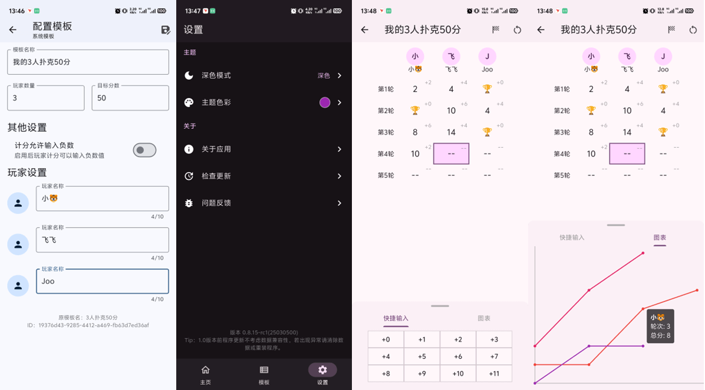

# 计分板

一个flutter计分板应用，支持多平台运行。推荐使用 Android 体验，其他平台尚未完整测试。

个人学习作品。本大量项目使用 ai 辅助编程，代码中注释可能由ai生成，仅供参考。

程序支持：

- 自定义计分模板
- 深色模式与8种预定义主题
- 计分功能与图表走势
- 快捷输入分数

<p style="text-align: center;">
    
</p>

## 下载

带有 beta 或 alpha 后缀的版本为测试版，带有 rc 后缀的版本为正式版。请按需下载。

<a href="https://github.com/youzhiran/counters/releases"></a>


## 编译

### 当前平台各架构打包方法

1. 安装 Flutter 和对应平台环境

2. 构建当前平台各架构应用

  ```bash
  dart .\setup.dart
  ```

3. 输出文件夹在项目根目录dist目录下

### Windows打包安卓和Windows

  ```bash
  dart .\setup.dart all
  ```


## Todo list

### v0.8.x

0.8.x 版本功能已冻结，不再更新功能，仅修复bug

- [x] 计分功能
- [x] 模板保存与编辑
- [x] 快捷输入与高亮
- [x] GitHub CI/CD
- [x] 退出后保留计分
- [x] 历史计分功能
- [x] 计分面板得分走势图
- [x] 检查更新可区分测试/正式版


### v0.9.x

- [x] 程序日志系统
- [x] 全新设计的计分流程及玩家管理
- [x] 使用 sqlite 代替 hive
- [x] 优化中文字体显示效果
- [ ] 新增斗地主积分系统模板
- [ ] 局域网联机
- [ ] 快捷输入栏加入更多控制功能
- [ ] 更多新特性...

## 统计

支持开发最简单的方法是点击页面顶部的星号（⭐）

或点击[下载](https://github.com/youzhiran/counters/releases/latest)体验


