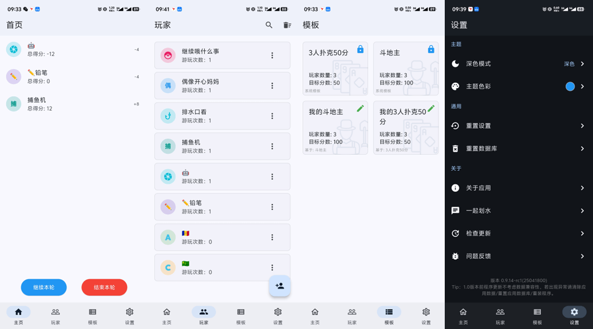
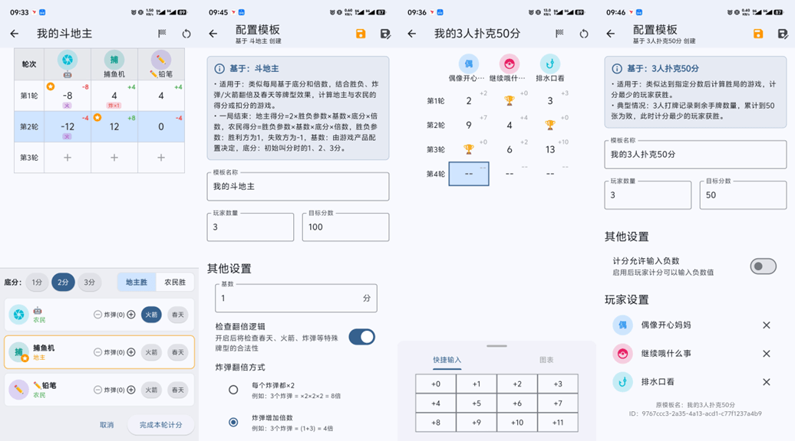

# 计分板

一个flutter计分板应用，支持多平台运行。推荐使用 Android 体验，其他平台尚未完整测试。

个人学习作品。本大量项目使用 ai 辅助编程，代码中注释可能由ai生成，仅供参考。


_想要快速了解本项目？可查看 DeepWiki ：_
 
[](https://deepwiki.com/youzhiran/counters)

## 程序主要功能与截图

Counters 是一款用于桌游计分的 flutter 多平台计分程序，目前程序支持以下游戏的计分。

- 计分扑克牌
- 斗地主
- 麻将（两位小数计分）
- 点击计数器

Counters 同时支持下面的特色功能：

- 计分走势图
- 局域网连接，同步查看计分数据

_图片供参考，最新 UI 及特性请下载安装包体验_

<p style="text-align: center;">
    
    
</p>

## 下载

带有 beta 或 alpha 后缀的版本为测试版，带有 rc 后缀的版本为正式版。请按需下载。

<a href="https://github.com/youzhiran/counters/releases"></a>


## 编译

### 当前平台各架构打包方法

1. 安装 Flutter 和对应平台环境

2. 构建当前平台各架构应用

  ```bash
  dart .\setup.dart
  ```

3. 输出文件夹在项目根目录dist目录下

### Windows打包安卓和Windows

  ```bash
  dart .\setup.dart all
  ```

### Windows打包安卓

  ```bash
  dart .\setup.dart android
  ```

## Todo list

### v0.9.x

- [x] 程序日志系统
- [x] 全新设计的计分流程及玩家管理
- [x] 使用 sqlite 代替 hive
- [x] 优化中文字体显示效果
- [x] 设置&数据库重置功能
- [x] 数据迁移功能（目前仅限Windows）
- [x] 新增斗地主计分系统模板
- [x] 使用 Riverpod 管理状态
- [x] 玩家头像优化，支持显示 emoji 
- [x] 玩家页面支持搜索

### v0.10.x
- [x] 新增 麻将 模板，支持显示为 2 位小数计分
- [x] 新增 点击计数器 模板，点击单元格即可快速+1
- [x] 新增字体选择功能
- [x] 新增关于应用页面&软件许可
- [x] 新增测试版联机功能，支持查找局域网游戏，主机可设定得分，客户端同步查看得分
- [x] 新增数据备份与恢复功能，支持导入、导出应用数据
- [x] 新增管理备份功能，数据导入前可自动备份数据，支持还原和导出备份
- [x] 新增局域网端口自定义功能
- [x] 新增启动时检查更新选项，支持不检查、正式版、测试版选项
- [x] 新增隐私政策检测更新的特性
- [x] 测试版桌面模式，支持自适应横竖屏
- [x] 计分历史页面改版，可自适应 UI
- [x] 设置页面调整，开放「桌面模式适配」和「程序日志」选项
- [x] 全局支持走势图，数据点可显示多个重合点数据
- [x] 支持游戏中查看模板设置
- [x] 程序性能优化，页面切换加入动画
- [x] 全新设计的局域网联机状态，信息更详细，支持重连、管理等功能
- [x] 全新设计的消息系统，支持消息堆叠，界面更美观
- [x] 退出计分确认

## 统计

支持开发最简单的方法是点击页面顶部的星号（⭐）

或点击[下载](https://github.com/youzhiran/counters/releases/latest)体验


## 致谢

DeepSeek、Gemini、GPT、Claude、Trae、Cursor、Augment 等 AI 模型和工具的大力支持。

