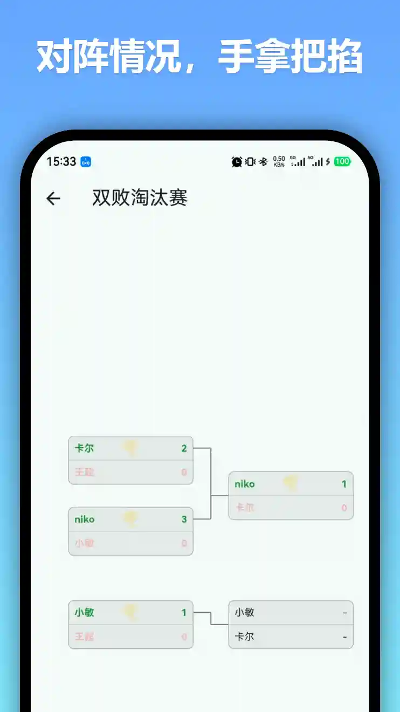
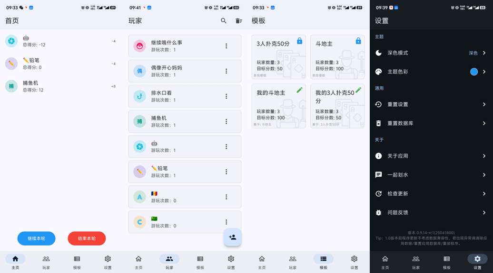
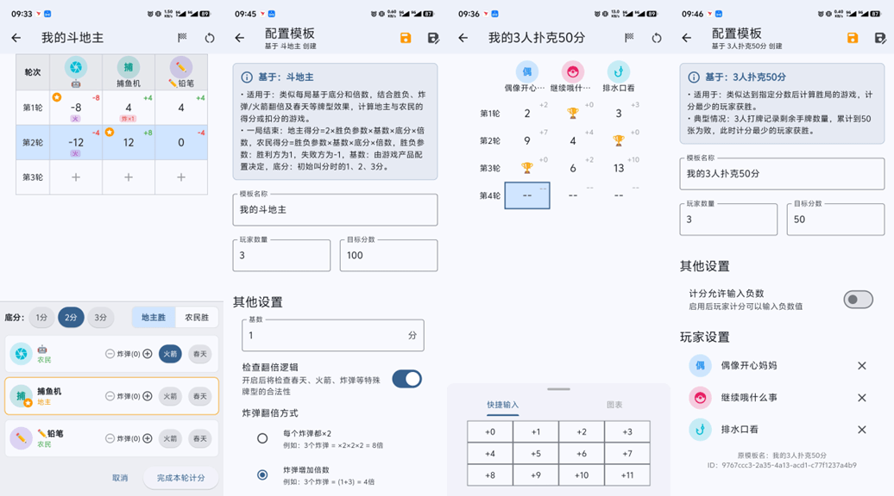

# 计分板

Counters 是一款基于 Flutter 构建的多平台桌游计分应用，目前支持 Android、Windows、鸿蒙
等平台。项目起源于个人学习实践，开发过程中大量借助 AI 辅助编程；如遇注释或实现存在疑问，欢迎在 Issue
中反馈。

想快速熟悉项目？可以访问 DeepWiki 了解更多技术信息：

[](https://deepwiki.com/youzhiran/counters)

## 目录

- [项目简介](#项目简介)
- [核心功能](#核心功能)
- [界面预览](#界面预览)
- [技术栈与架构](#技术栈与架构)
- [快速开始](#快速开始)
- [构建与打包](#构建与打包)
- [项目结构](#项目结构)
- [文档与指南](#文档与指南)
- [常见问题](#常见问题)
- [下载与发布](#下载与发布)
- [统计与支持](#统计与支持)
- [致谢](#致谢)

## 项目简介

应用专注于桌游或聚会场景下的计分统计，提供多种游戏模板（扑克 50 分、斗地主、麻将、点击计数器）与联赛模式，
能够在本地或局域网中同步计分数据。通过统一的模板体系、丰富的图表分析与备份机制，力求让小型聚会也能拥有接近专业赛事的记录与复盘体验。

## 核心功能

### 计分与模板

- 支持计分扑克牌、斗地主、麻将（两位小数）、点击计数器等内置模板。
- 模板可复制、另存和自定义，允许调整玩家人数、目标分、胜负规则等配置。
- 提供「快速体验」模式，可基于系统模板生成临时对局，立即开始计分。

### 统计与分析

- 计分走势图、轮次明细、成绩统计一目了然，支持查看历史计分记录。
- 联赛模式覆盖淘汰赛、循环赛，自动生成赛程与对阵图并同步结果。
- 内置掷骰子工具，支持多枚骰子动画投掷、结果历史回顾与滚动查看。

### 联机与备份

- 局域网实时同步计分数据，其他设备可通过浏览器查看即时比分。
- 提供数据备份与恢复工具，支持导入、导出相关数据。
- 支持 HTTP 实时比分模板，可为不同玩法提供专属展示页面。

## 界面预览

<div align="center">
  
  
  
  
  
</div>

_截图仅供参考，实际界面以最新发行版为准。_

<p style="text-align: center;">
    
    
</p>

## 技术栈与架构

- **框架**：Flutter 3.35+，支持 Material Design 3 风格与多平台自适配。
- **状态管理**：Riverpod + `riverpod_annotation` 自动化生成。
- **数据存储**：Sqflite、SQLite FFI，配合本地模板与会话缓存。
- **网络联机**：WebSocket + HTTP，用于局域网同步与实时比分页面。
- **工具库**：`shared_preferences`、`flutter_svg`、`animations`、`wakelock_plus` 等。
- **代码生成**：`build_runner`、`freezed`、`json_serializable`、`riverpod_generator`。

项目将通用模型封装在 `lib/common`，按功能域拆分 `lib/features`，并结合文档目录 `docs/` 与 `AGENTS.md`
给出开发规范。

## 快速开始

### 环境准备

1. 安装 Flutter（建议 3.35 及以上）及对应平台 SDK（Android Studio、Xcode、Windows SDK 等）。
2. 运行 `flutter doctor` 确认环境就绪。

### 克隆与依赖

```bash
git clone https://github.com/youzhiran/counters.git
cd counters
flutter pub get
```

### 启动调试

```bash
flutter run
```

常用入口：

- 主页面：查看模板、快速操作、正在进行的对局。
- 设置：切换主题、启用局域网联机、导入导出数据。
- 掷骰子：通过计分页面右上角工具栏快速打开。

## 构建与打包

项目提供 `setup.dart` 脚本统一打包。示例命令（在 Windows PowerShell 或终端执行）：

```bash
dart .\setup.dart            # 构建当前平台发行包
dart .\setup.dart all        # Windows 主机一次性打包 Windows 与 Android
dart .\setup.dart android    # Windows 主机仅打包 Android
```

生成的安装包位于项目根目录的 `dist/` 文件夹。

如需使用标准 Flutter 命令：

```bash
flutter build apk --release
flutter build windows --release
```

## 项目结构

```
counters/
├─ lib/
│  ├─ app/                # 全局状态、主题与入口配置
│  ├─ common/             # 通用模型、组件、工具函数
│  ├─ features/           # 业务模块（score、league、lan、history 等）
│  └─ main.dart           # 应用入口
├─ assets/                # 图片、SVG、局域网比分 HTML 模板
├─ docs/                  # 项目文档与开发指引
├─ snapshots/             # README 展示用截图
├─ setup.dart             # 多平台打包脚本
└─ pubspec.yaml           # 依赖与资源声明
```

## 文档与指南

- `AGENTS.md`：仓库协作规则、全局组件说明。
- `docs/new_scoring_template_guide.md`：新增计分模板的改动清单。
- `CHANGELOG.md`：版本历史。

补充文档前可先与维护者确认命名与目录，保持知识体系一致。

## 常见问题

- **如何开启局域网实时比分？**  
  在设置中启用“HTTP 实时计分服务”，按界面提示访问局域网地址即可在浏览器查看比分。

- **如何扩展新的计分模板？**  
  参考 `docs/new_scoring_template_guide.md`，按模型、页面、联机、模板资源四个维度同步修改。

- **如何迁移数据到新设备？**  
  使用“数据备份与恢复”导出 ZIP 包，在新设备导入即可恢复玩家、模板与历史记录。

## 下载与发布

- 发布版本命名遵循语义化：`alpha`/`beta` 为测试版，`rc` 为候选正式版。
- 最新安装包请访问 GitHub Releases：

<a href="https://github.com/youzhiran/counters/releases"></a>

## 统计与支持

支持项目最简单的方式是为仓库点一颗 ⭐ 或下载体验并反馈意见。

- [下载最新版本](https://github.com/youzhiran/counters/releases/latest)
- 

## 致谢

感谢 DeepSeek、Gemini、GPT、Claude、Trae、Cursor、Augment、Gemini CLI、XCode 等 AI
模型与工具在开发过程中的启发与辅助，也感谢每位使用者与贡献者的建议，让「得益计分」在真实场景中持续进化。
